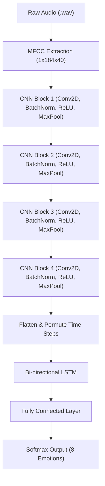

# 🎧 EchoMind: Real-Time Speech Emotion Recognition with CRNN

EchoMind is a full-stack web application that predicts human emotions from speech using a Convolutional Recurrent Neural Network (CRNN). It supports real-time emotion prediction on audio files and provides a clean UI with waveform visualizations and results.

---

## 🧠 Model Pipeline

This project implements a **Speech Emotion Recognition (SER)** system using a **Convolutional Recurrent Neural Network (CRNN)**, designed to classify human speech into one of 8 emotional states.

### 🔧 Architecture Overview

The model follows a **CRNN pipeline**:



1. **CNN Feature Extractor**:
   - 4 convolutional blocks (Conv2D → BatchNorm → ReLU → MaxPooling)
   - Captures spatial features from the MFCC time-frequency representation.
2. **Bi-directional LSTM**:
   - Input: Flattened output from the CNN (time steps preserved)
   - Captures long-range temporal dependencies in speech.
3. **Fully Connected Layer**:
   - Output: Softmax probabilities for each emotion class.

---

## 📈 Input Features

- **MFCCs (Mel-Frequency Cepstral Coefficients)** extracted using `librosa`
- Sampling Rate: `16,000 Hz`
- FFT window size: `512`
- Hop length: `256`
- MFCC Coefficients: `40`
- Fixed segment duration: `3 seconds` (from 0.5s to 3.5s)
- Normalization: Z-score
- Input shape to model: `(1, 1, 184, 40)` → `(batch, channel, time, mfcc)`

---

## 🎭 Emotion Classes

The model is trained to detect the following 8 emotions:
- `angry`, `calm`, `disgust`, `fearful`, `happy`, `neutral`, `sad`, `surprised`

---

## 🧪 Training Details

- **Dataset**: RAVDESS (Ryerson Audio-Visual Database of Emotional Speech and Song)
- **Model file**: `python-backend/crnn.pth`
- **Loss Function**: CrossEntropyLoss
- **Optimizer**: Adam
- **Epochs**: 30
- **Batch Size**: 32
- **Data Split**: 80-20 stratified split was done per emotion, separately for speech and song subsets.
- **Notebook**: The training notebook is available at `notebooks/ser-final.ipynb`.

---

## 📊 Evaluation

Overall F1 Scores:
- Macro  F1-score:    **0.8423**
- Weighted F1-score: **0.8436**

---

## 🔧 Usage

**1. Running the Next.js Frontend:**
```bash
npm install
npm run dev
```
The frontend will be available at `http://localhost:3000`.

**2. Running the Python Backend (FastAPI):**
```bash
pip install -r python-backend/requirements.txt
uvicorn python-backend.main:app --reload
```
The backend API will be available at `http://localhost:8000`.

**3. Single File Prediction Script:**
You can also run predictions from the command line without the server:
```bash
python python-backend/predict.py --file ./path_to_audio.wav --model python-backend/crnn.pth
```
